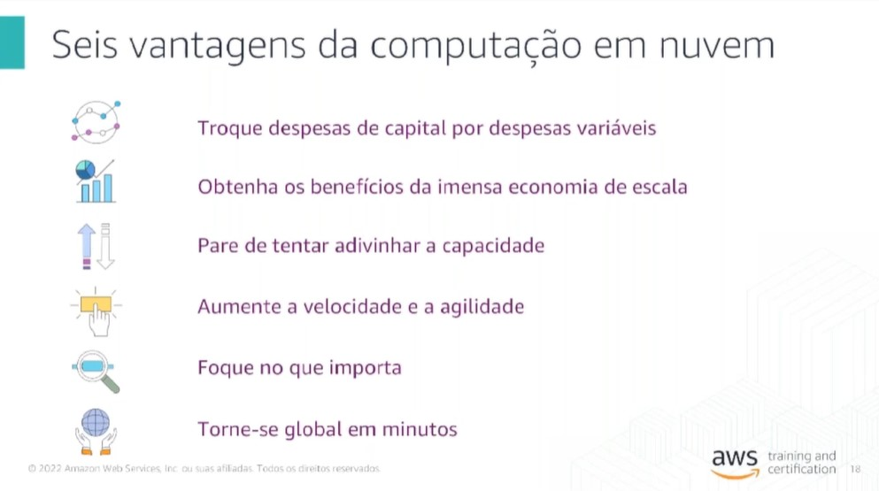
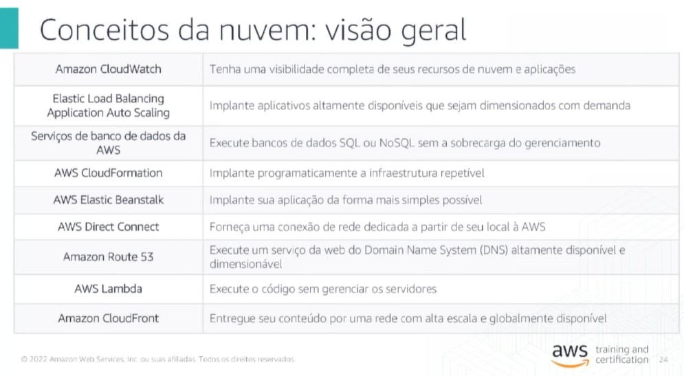
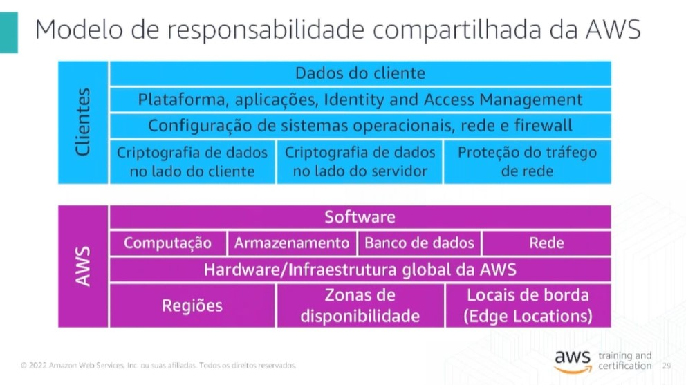
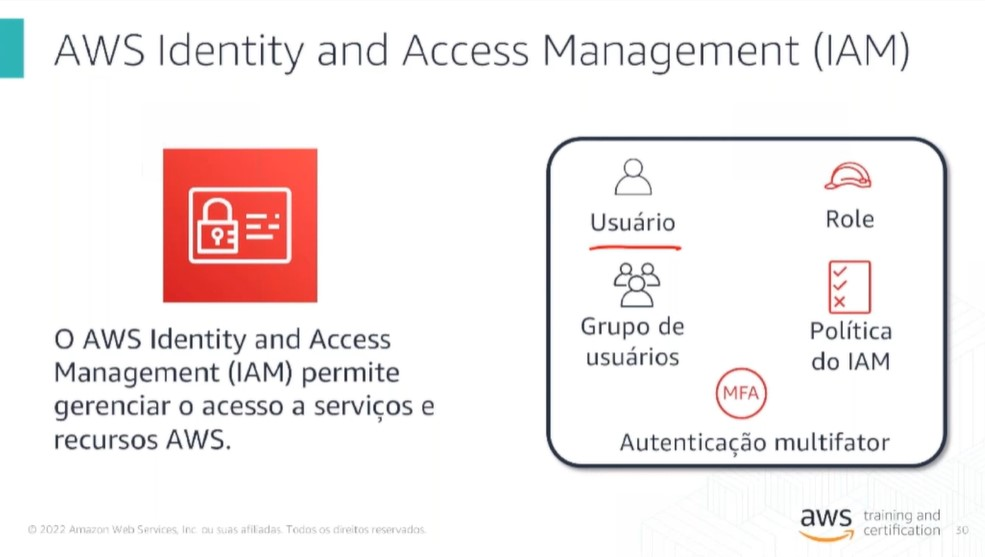
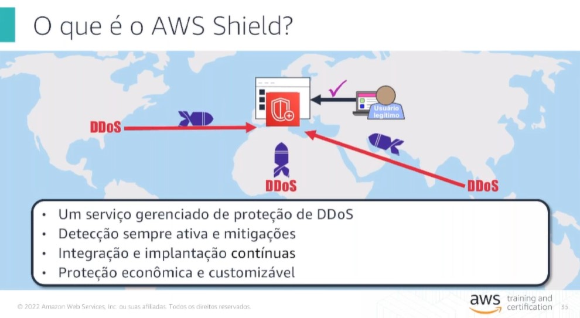
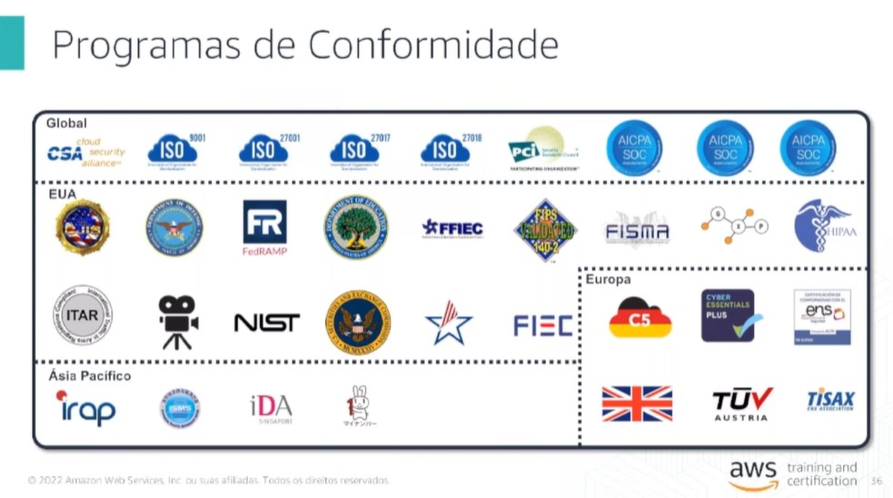

# Revisão do exampe Cloud Practicioner

## Dominios
* 1. Conceitos da nuvem
* 2. Segurança
* 3. Tecnologia
* 4. Faturamentoe  Preco 

Preparação para o exame de certificação da AWS 
https://aws.amazon.com/pt/certification/certification-prep/

Recomendado fazer em Português

* presencial (personal vue nos centros de treinamento)

Interfaces de gerenciamento para acesso a conta
* AWS Managment Console
* CLI (programatica)
* SDKs

Pessoal, página da Pearson Vue: https://home.pearsonvue.com/Test-takers/Resources.aspx#faqs

# Vantagens

# Visao Geral Nuvem

# Segurança

Roles são acessos temporários.

Proteção DDoS. É ativado em todas as contas, existem duas opçoes de Shield, o standard já ativado por default. 

Programas de conformidade
https://aws.amazon.com/pt/compliance/programs/

# Tecnologia

Regiao - Localizacao fisica pela mundo, um ponto geografica com duas ou mais data center (zonas de disponibilidades)

Locais de borda, onde não tem uma regiao estabelecida

Pessoal, para acessar ao conteúdo sob demanda de maneira gratuita: Treinamento Digital - AWS Cloud Practitioner Essentials (CPE) – Português https://explore.skillbuilder.aws/learn/course/external/view/elearning/8287/aws-cloud-practitioner-essentials-portuguese

https://aws.amazon.com/pt/training/ramp-up-guides/