# Cloud Computing Essentials

## Amazon S3 Overview
S3 is a _Object Storage Service_, object consist on data and metadata, the metadata is a set of name-value pairs that describe the object. 
Object is stored in S3 bucket and the object is uniquely identified by a key.

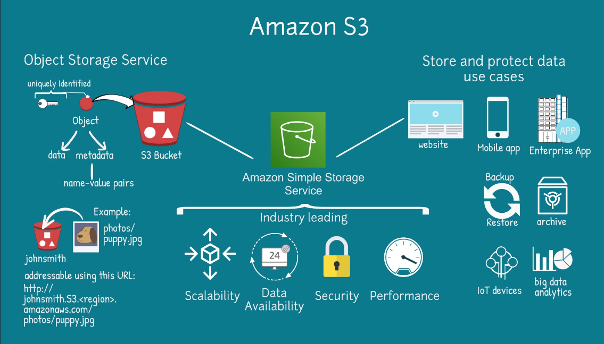
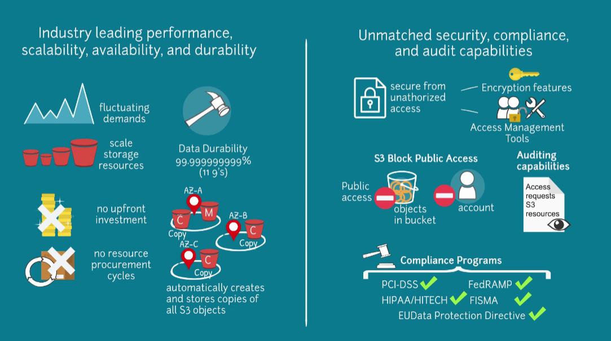
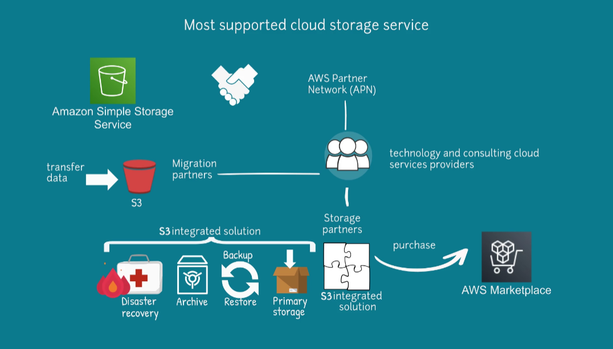

### Features

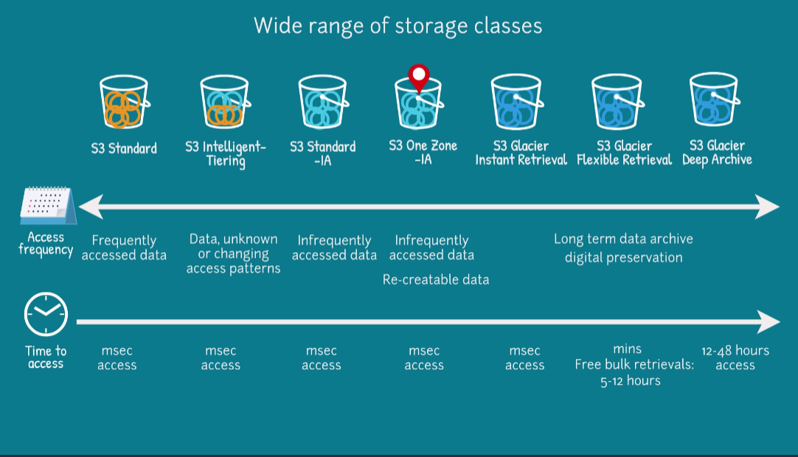
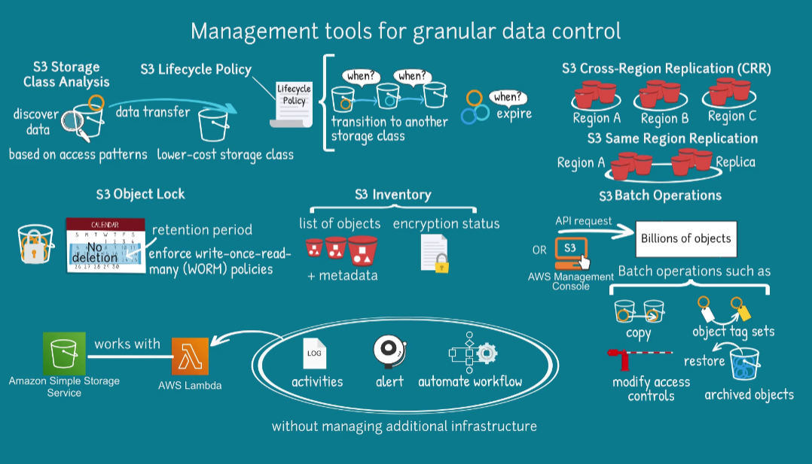
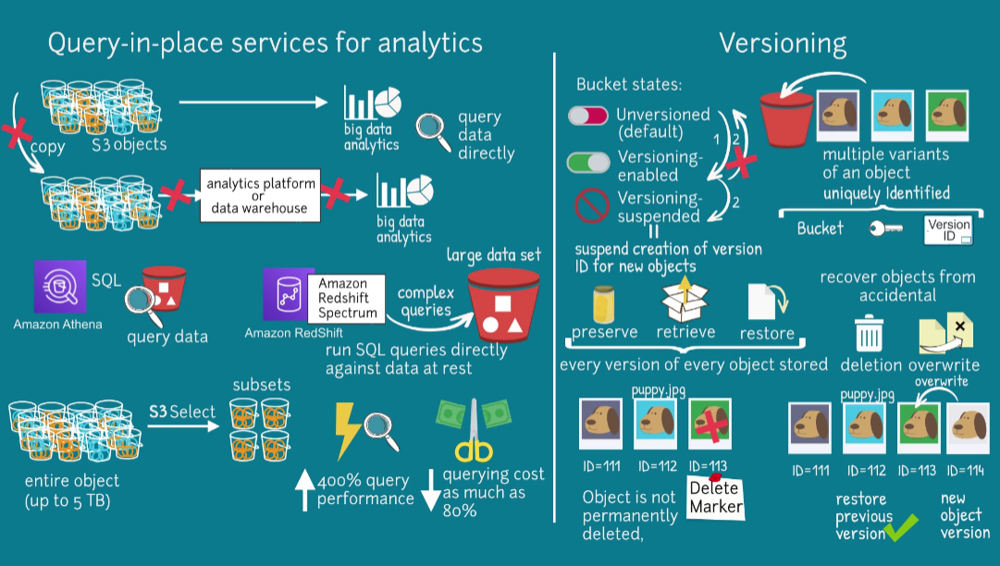
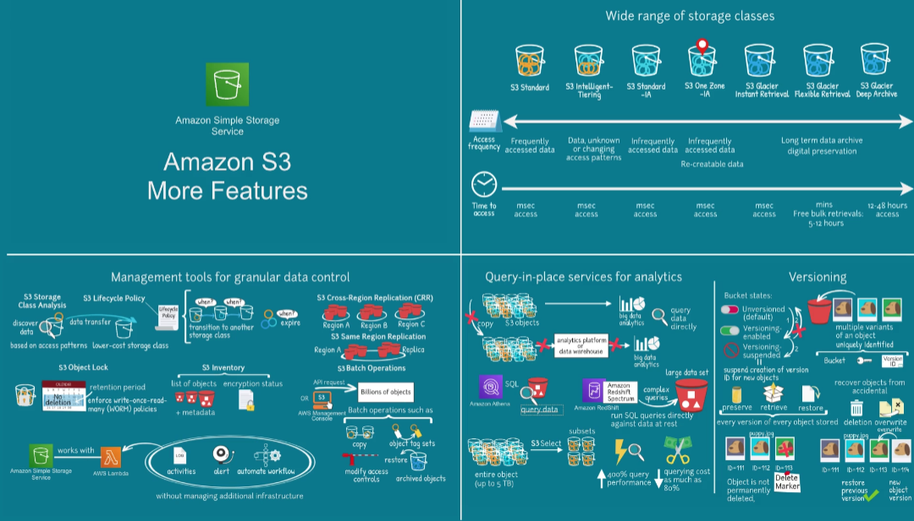

### Access Management

By default all Amazon S3 resources such as bucket and object are private.

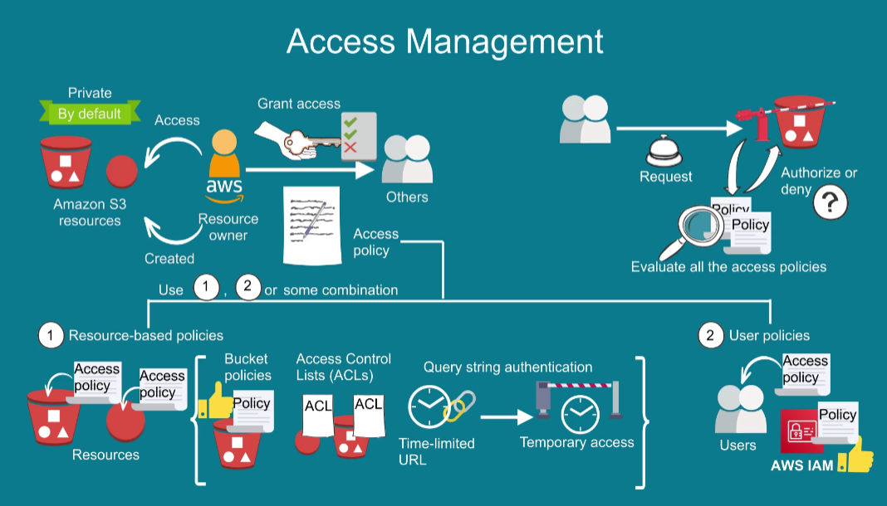
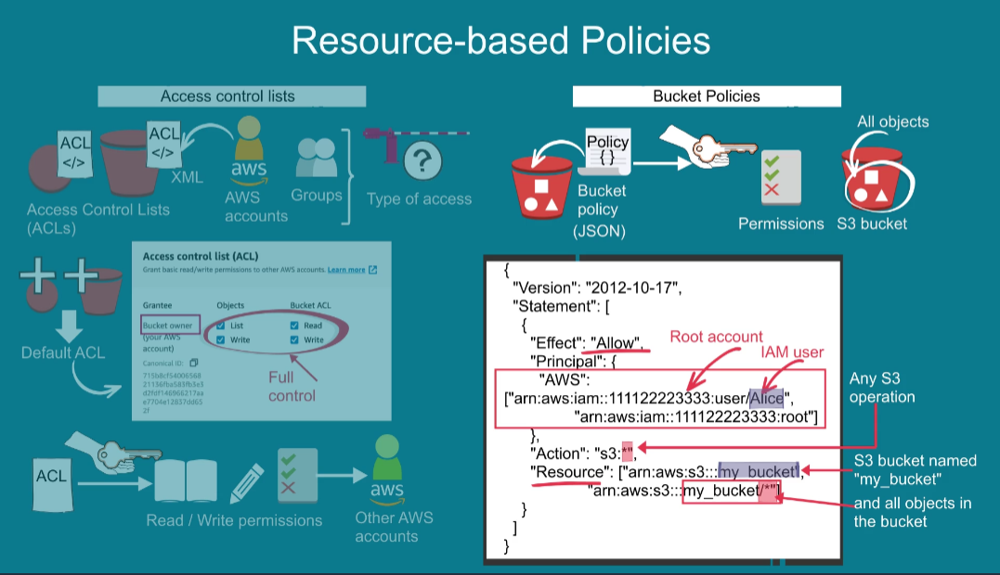
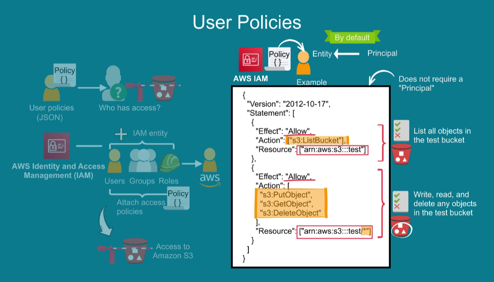
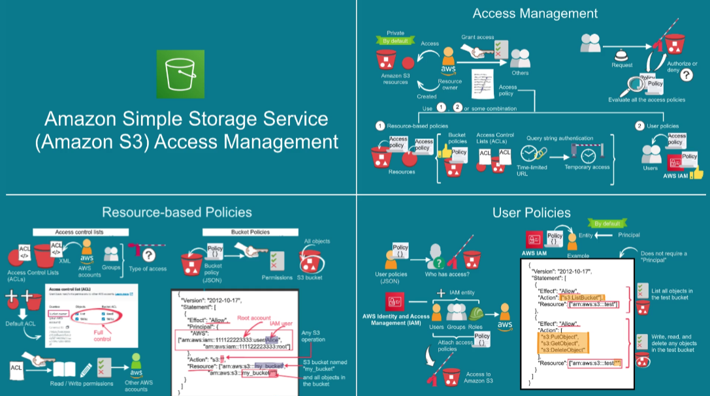